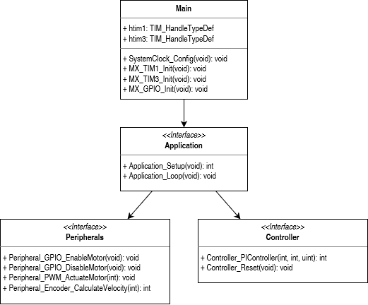
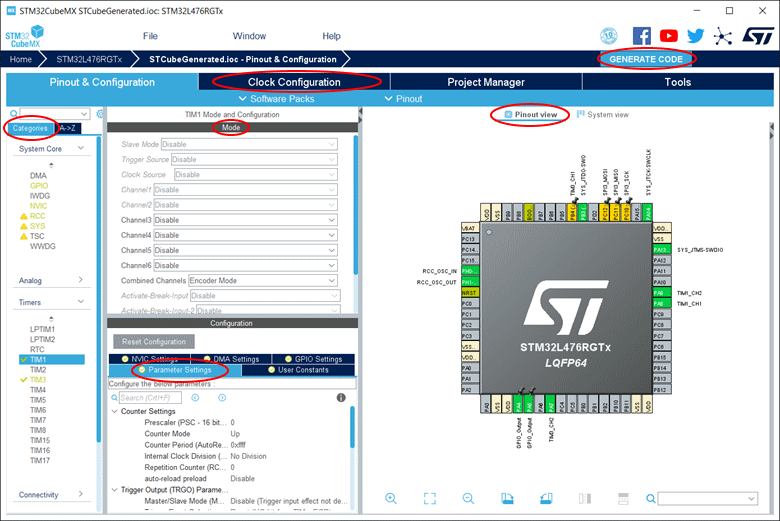
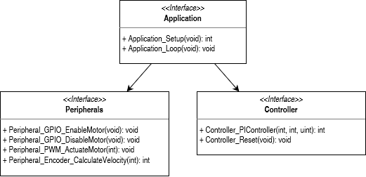
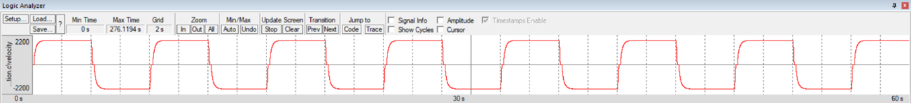
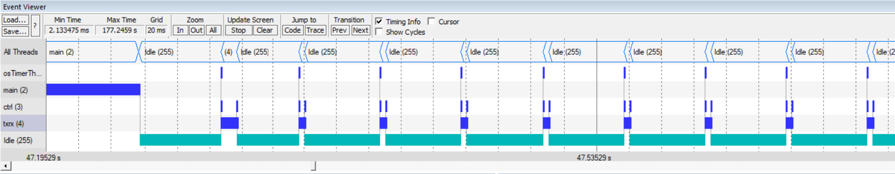

# MF2103 - Programming Project
## Introduction

This project is divided into three tasks, which correspond to the respective modules of the course MF2103. They are as follows

1. Digital I/O and control
2. Real-time operating systems
3. Distributed systems using TCP/IP

You are to develop and submit each task separately, over the progress of the course. The three tasks to be submitted are found under sections

1. [Task 1: Motor control](#1)
2. [Task 2: RTOS](#2)
3. [Task 3: TCP/IP](#3)

The project however starts with [Task 0](#0), where we guide you through the steps of creating the project structure and configuring the microcontroller. In between your tasks, we will also guide you through some further configuration steps to make sure you focus on the course content and avoid many microcontroller-specific issues.

## Prerequisites
It is assumed that you have completed all activities of a module before you can start working on the task for that particular module.

## Intended outcome
After completing this project, you will be able to:

- Develop modular, interface-based programs for embedded systems
- Use professional toolchains for the ARM Cortex-M microprocessor
- Utilise standard hardware abstraction layers to access memory-mapped hardware
- Read the application programming interface (API) for external libraries
- Develop an embedded application, running on a real-time operating system (RTOS)
- Design a distributed, embedded control system using TCP/IP over Ethernet
  
## Reporting & Deadlines
Submit your code for each task to the appropriate assignment on Canvas.

You will also need to present your results to a member of the teaching team.

## Submission guidelines:
1. You need only submit the C-code and no additional documents.
2. In section 7.6, you will be give an initial set of skeleton files to start with. You are allowed to modify the C-files, but you cannot modify the header H-files.
3. Only submit the C-files and H-files you have created or modified. Do not submit the whole project.
4. You code should be well documented, with explanatory comments.

Remember the possibility to obtain a bonus point on the last module! See the course memo!

Bonus points can be awarded for [Task 1](#1) and [Task 3](#3).

## References
See the Course Literature page on Canvas for the list of documents referred to in this report. (\[Wolf-CasC] , \[Martin-DG] , \[STM-Pinout] , etc.)

## Hardware platform
The prototyping platform has already been assembled and will be provided to you. Please do not disassemble the board, to avoid damage to the pins.

The hardware platform used in this course consists of the following hardware stack:

The STM32 Nucleo board with a STM32L476RGT6 microcontroller
- BTN8982 DC Motor Control Shield
- AM-EN1611S003-0512 Encoder
- AM-CL1643MAE-1210 Brushed Coreless Motor
- W5500 Ethernet Shield

## Project Description
In this project, you are to develop an embedded control system on the STM32 target hardware. The software is expected to control the speed of a motor, using a PI-control algorithm. Ultimately, you are expected to develop this software over a distributed system, where one processor is used to calculate the control signal, while another is used to handle the sensors and actuators. Luckily, we have already hired an architect that have already broken down the software into 4 modules. You will be even provided with a code skeleton of each module. Each module consists of an interface (header-file), and implementation (C source code). It will be your job to implement these modules, without altering the interfaces.

The Figure below shows the project modules.



One of the ideas behind this project is to give you a feel for working on a large-scale project, with development done by several software teams in parallel. You can imagine that there are four teams working on this project. Each team working on different layers of the software, roughly translating to the different areas of mechatronics. Your task will be to assume the roles of the different teams, detailed below.

1. The core team is responsible for configuring the microcontroller, initialising the necessary clocks, peripherals, and setting up the ethernet interface. This is implemented in the main module.
2. The hardware team is responsible for working with the sensors and actuators. It assumes that the core layer works as it expected but is only dependent on CMSIS Core. This is implemented in the peripherals module.
3. The control team is responsible for developing the control algorithm for the motor. It assumes that the core and hardware layers work as they should. This is implemented in the controller module.
4. The application team is responsible for the top-level functionality. It assumes all the lower layers work as they should. This is implemented in the application module.

## Delimitations
You are expected only to use integer-valued operations. There must not be any floating-point variables, literals, or instructions in your solutions!

Unlike high-level scientific programming for general-purpose PCs (MATLAB, Python, etc.), the code you will develop will run directly on low-power, memory-constrained embedded devices. Over the course of the project, you will learn how to write efficient code for fast and explainable execution, and how to leverage a few built-in ARM-specific “intrinsic” instructions for optimizing your code further.

## <div id="0">Task 0: Project Setup and Microcontroller Configuration</div>
For this first task, you will assume the role of the Core team, and your task is to configure the microcontroller, initialising the necessary clocks, peripherals, and setting up the internet protocol. Based on the overall architecture, you are told that that following features are needed:

1. A PWM signal to drive the DC-motor to the desired speed.
2. An encoder to calculate the actual motor speed

So far in Tutorial 2, you have learnt to configure your microcontroller by analysing the reference manual, and writing program code to configure the desired peripheral, through its memory-mapped registers. You have also taken advantage of the CMSIS Core, that included all the necessary variables and macros to configure and access peripherals, with a higher level of abstraction.

In this task, you will take advantage of an even higher-level approach. STM32CubeMX is an application that provides a convenient graphical user interface for configuring your specific microcontroller, its pins, peripherals, clocks, etc. Once configured, you can then use the STM32CubeMX code generation tool to produce C-code that initializes the device. The generated code is still CMSIS-compliant. This approach essentially replaces the effort of reading the reference manuals, and programming the registers of the peripherals, as detailed in Tutorial 2.

STM32CubeMX is well integrated and works seamlessly with Keil MDK. So let’s start by creating a new development project in Keil MDK, after which we will trigger STM32CubeMX to configure the device, and generate the necessary configuration code. Finally, we will come back to Keil MDK to develop the remaining manual code.

### Install STM32CubeMX
Just one more application to install. Download and install STM32CubeMX from https://www.st.com/en/development-tools/stm32cubemx.html.

Note that STM32CubeMX needs a Java run-time environment (JRE). So, if you don’t have it installed, do it from https://www.java.com/en/download/.

### Create a new project using Keil MDK
Refer to instructions form Tutorial 1 if necessary!

1. First, create a new project in the Keil MDK (Microcontroller Development Kit).
    - Keep in mind: you should not need to create multiple copies of this project, and you will not need to make a new project for the different tasks. Development will be incremental, and you will learn techniques for handling code variants within the same project structure. Name your project accordingly—don’t call it Task0...
    - If you are interested in versioning while developing code, you should consider Git. KTH provides all students with GitHub Enterprise for free!
2. When prompted for the Device for Target, select STM32L476RG.
3. When prompted to “Manage Run-Time Environment”, choose the following software components that you want included in your new project:
    - Compiler &rarr; I/O
        - STDOUT &#10004;, Variant: ITM
    - Device &rarr; Startup: &#10004;
    - Device &rarr; STM32Cube HAL
        - GPIO: &#10004;
        - SPI: &#10004;
        - TIM: &#10004;
4. You will notice that some of the selections are orange in color. This means that the selections require additional components. Click Resolve, to automatically fill in the missing dependencies.
5. Click OK.
6. Having identified that the selected device can be supported by STM32CubeMX, Keil MDK will prompt you to launch the STM32CubeMX application. Do it now. (If you get prompted for a missing Java JRE, see instructions in section 7.1)

### Configure Device using STM32CubeMX
In the following subsections, we will use STM32CubeMX to configure the Nucleo-L476RG board as follows:

1. Core clock frequency to be set to 40 MHz.
2. CoreSight debugging to be enabled through the ST-Link debug adaptor.
3. TIM1 timer to be configured for encoder mode. This timer will behave more like a counter, which will count the motor encoder pulses without the need for any interrupts.
4. TIM3 timer to be configured for PWM generation mode. The timer will produce a PWM signal with a frequency of 20 kHz.

The application consists of several windows and pages. For each peripheral, there is a Mode (upper half) and Configuration (lower half) window, which helps organize the setup. The appearance of the Configuration window will be dependent on the choices made in the Mode window, so make sure you follow the instructions in the correct order. For now, you will only need the “Parameter Settings” tab in the Configuration window.

To help you navigate, please refer to the figure below that highlights some of the main sections referred to in the instructions below.



Under the Pinout & Configuration page, in the leftmost panel (under Categories), configure the following peripherals:

System Core
1. RCC (Reset and Clock Controller)
    - Mode
        - High Speed Clock (HSE) &rarr; Crystal/Ceramic Resonator
        - Low Speed Clock (LSE) &rarr; Disable
2. SYS (System)
    - Mode
        - Debug &rarr; Trace Asynchronous Sw

Timers
1. TIM1 (Advanced-control timer)
    - Mode
        - Combined Channels &rarr; Encoder Mode
    - Configuration [Parameter Settings]
        - Prescaler (PSC) &rarr; 0
        - Counter Period (ARR) &rarr; 65535 (or 0xFFFF in hexadecimal)
        - Encoder Mode &rarr; Encoder Mode TI1 and TI2
            > Think about the period of the encoder counter timer. Why is it set to 0xFFFF? Keep this in mind for when you will initialise the timers.

2. TIM3 (General-purpose timer)
    - Mode
        - Channel 1 &rarr; PWM Generation CH1
        - Channel 2 &rarr; PWM Generation CH2
     - Configuration [Parameter Settings]
        - Prescaler (PSC) &rarr; 0
        - Counter Period (ARR) &rarr; 2047 (decimal)
        - Mode &rarr; PWM mode 1
            > Think about the period of the PWM timer. Why is it set to 2047? What is the resulting PWM frequency?

Next, you will configure the functionality of some of the pins. Recall that a given pin can be used for general purpose I/O, as well as several alternate functions, which are determined by the hardware. By selecting the pin function here, all other functions are disabled. In the Pinout view, set the pin functionality according to the following table: (Note that in some cases, the pin might already be set to as desired)

Table 1. Pin Configuration

|Pin	|Selection|
|---|---|
|PB4	|TIM3_CH1|
|PB3	|SYS_JTDO-SWO|
|PA14	|SYS_JTCK-SWCLK|
|PA13	|SYS_JTMS-SWDIO|
|PA9	|TIM1_CH2|
|PA8	|TIM1_CH1|
|PA5	|GPIO_Output|
|PA6	|GPIO_Output|
|PA7	|TIM3_CH2|
|PH0	|RCC_OSC_IN|
|PH1	|RCC_OSC_OUT|

After that, we will configure the main clocks to the desired frequency.
- Under the “Clock Configuration” page, set HCLK to 40 Mhz.
- You may get a prompt that “No Solution found using current selected Sources”. Click OK to use other sources.
- If successful, all clocks on the right will show 40 MHz.

Finally, it is time to generate the configuration code.
1. Under the “Project Manager” page, click GENERATE CODE in the top right.
2. You may be prompted to download some software packages. Accept.
3. You will eventually be prompted that the code was successfully generated. Press Close.
4. Keil MDK might also prompted that “for the current project new generated code is available for import”. Press YES to import changes.
5. You may close the STM32CubeMX application and return to Keil MDK.
6. Your Keil project now contains all the necessary code to initialize the device as graphically specified in STM32CubeMX.

Note: It may warn that the project generation encountered a problem, but the code should still be ok!

### Configure Compiler Options
Now, you will set some of the compiler settings for the Project—you will use settings which have been chosen to achieve a balance between code size, debug view, and compilation-time feedback. If interested, you can read more about it here.

Back in Keil MDK, select the magic wand to open Options for Target... window.

1. Under the Target tab, in the Code Generation section
    - ARM Compiler: Use default compiler version 5
    - Use MicroLIB: &#10004;
2. Under the C/C++ tab
    - Optimization: Level 0 (-O0)
    - One ELF Section per Function: &#10004;
    - Warning: All Warnings
    - C99 Mode: &#10004;
    - Misc Controls: `--diag_error=223`

### Configure Debugger Options
1. Under the Debug tab, choose ST-Link Debugger, then click Settings.
2. In the new window that appear, select the Trace tab
    - Set the Core Clock to 40 MHz
    - Trace Enable: &#10004;
    - Untick EXCTRC: Exception tracing under Trace Events
    - Untick all ITM Stimulus ports except Port 31 and 0.
        > Check Tutorial 1: "ST-Link/V2 and Keil", section 19 again. What features are you actually interested in enabling?
3. Select the Flash Download tab
    - Select Erase Full Chip
    - Program: &#10004;
    - Verify: &#10004;
    - Reset and Run: &#10004;
4. Select OK twice, to close all dialog windows.

### Add Skeleton C- & H-files to the project
As promised, in this project, you are to be given a skeleton code that you are expected to complement. It is now time to copy this skeleton code into your project.

1. Download and copy the skeleton code files Download skeleton code filesto you project.
    Open a Windows File Explorer
    - Go to the folder where your project files exist.
    - Download, unzip and save the folders Source and Include from the course material to the base directory of your Keil project. (That is, the folder where the *.uvprojx file exists. and not for example the MDK-ARM folder).
2. Import C-files into your project in Keil MDK
    - Go to Keil MDK.
    - Inside the Project window on the left, right-click Target 1 and choose Manage Project Items...
    - Click Add Files... and add the following files to the empty “Source Group 1”.
    - source/peripherals.c
    - source/controller.c
    - source/application.c
    - You have now made these C-files part of the project, which means they will be compiled and linked when you build the project.
3. Next, we need to include the folder that contains header h-files in the “include path”.
    - Right-click Target 1 and select Options for Target ‘Target1’.
    - Under C/C++, click the “...” next to Include Paths,
    - In the new window that appears, click the “new” button, and then the “...” that appears.
    - In the File Dialog that appears, select the Include folder containing the header files.
    - select OK to close all dialogs.

You noticed from the instructions above that c- & h-files are handled differently. Why is that? A project consists of C-files that get compiled and linked into an executable. H-files are not directly part of this process. However, H-files are included in C-files (or other H-files), when a file includes a directive such as #include “controller.h”. Note here that the C-file does not specify the complete path to the controller.h file. So, for the complier to know where to find such h-files, we need to configure the Include Paths, to include the set of folders where the compiler can find them.

Note here that the Project window in Keil MDK is not a file manager and does not necessarily reflect the actual structure inside the folder containing your project. Rather, it is organized in Source Groups, which are the files that will be compiled by the toolchain. So, you need to be careful when you move files around in Keil MDK and/or Windows File Explorer, since the two are not in synch.

To make your project structure more comprehensible, you can consider the following:

1. Rename “Target 1” to something more appropriate, like “Non-distributed”. (to rename, click on the item, then click on the item again after 1-2 seconds)
2. Rename “Source Group 1” to “Modules” or something similar

### Develop the code
The code generated by STM32CubeMX is meant to be modified manually by a programmer. One should also be able to reconfigure the device, and regenerate code to reflect these changes. With such re-generation, it would not be desired if any manual code is lost.

To solve this conflict, the generated code includes USER CODE blocks within which the programmer can write any manual code. Code within such blocks is safely preserved across regenerations. Any code outside the USER CODE blocks will be overwritten upon new code generations.

The main.c file is the main (as the name suggests 😊) entry point, which contains the main function.

> Analyse the content of the main function and try to understand what it tries to do. Try to also navigate to the functions called from this main function, to understand what they do in turn.
> 
> Tips: To jump to a specific function, right-click on that line, and select “Go to Definition ...”. This will jump to that function, which can be either inside the same file, or open a new file that contains the function.

The main file is used to perform initial setup of the board after startup. It contains an endless loop that is meant to invoke all application-specific code. The architect wants to minimize adding any application-specific code to this main.c file. To do so, you are asked to insert function calls to the Application module instead, where the application-specific code is written.

So, in main.c, add the following pieces of code within the appropriate user block. Do not simply copy/paste this code into the user blocks but retype it (and let the Keil IDE help you autocomplete as you type). To better understand:

- Read through the existing code from the top-down and try to understand the existing statements, as well as the overall structure.
- When adding the specific code blocks below, make sure you understand what you are adding, and the context within which you are adding this code.

- Include header files
    ```C
    /* USER CODE BEGIN Includes */
    #include <stdio.h>
    #include "application.h"
    /* USER CODE END Includes */
    ```
- Just after all peripherals are initialized, make a call to the `Application_Setup()` function, in order to do any necessary other configurations.
    ```C
    /* USER CODE BEGIN 2 */
    Application_Setup();
    /* USER CODE END 2 */
    ```
    > What does this function do? Why is this function called after the peripherals are initialized? Could it be ok to call it before?

- Make a call to the `Application_Loop()` function.
    ```C
    /* USER CODE BEGIN WHILE */
    while (1)
    {
    Application_Loop();
    /* USER CODE END WHILE */

    /* USER CODE BEGIN 3 */
    }
    /* USER CODE END 3 */
    ```
    > Where in the main function is this function called? What is the purpose of this function call?

- Start the Timer1 peripheral channels
    ```C
    /* USER CODE BEGIN TIM1_Init 2 */
    HAL_TIM_Encoder_Start(&htim1,TIM_CHANNEL_1);
    HAL_TIM_Encoder_Start(&htim1,TIM_CHANNEL_2);
    /* USER CODE END TIM1_Init 2 */
    ```
    > Where is this located in the code structure? When will this initialization occur during runtime? Put a breakpoint, and make sure you understand when this is called. What is the period of the Timer 1? Why was it set this way?

- Start the Timer3 peripheral channels
    ```C
    /* USER CODE BEGIN TIM3_Init 2 */
    HAL_TIM_PWM_Start(&htim3, TIM_CHANNEL_1);
    HAL_TIM_PWM_Start(&htim3, TIM_CHANNEL_2);
    /* USER CODE END TIM3_Init 2 */
    ```
    > Where is this located in the code structure? When will this initialization occur during runtime? Put a breakpoint, and make sure you understand when this is called. What is the period of the Timer 3? Why was it set this way?

The architect also desires to provide a function that returns the clock tick in milliseconds. This function is available by calling HAL_GetTick(). However, the architect wants to wrap this hardware-specific function call to avoid other modules directly calling HAL functions. Remember: even if the underlying hardware is changed, the other modules should not have to be altered.

1. In main.h, declare a new function.
    ```C
    /* USER CODE BEGIN EFP */
    uint32_t Main_GetTickMillisec(void);
    /* USER CODE END EFP */
    ```
    Tips: To open main.h, right click anywhere in main.c and click Toggle Header/Code File.
    >What does this declaration do? Why is it added to the h-file and not the c-file? What happens if you remove this declaration and try to build the code?

2. Define the function in main.c
    ```C
    /* USER CODE BEGIN 0 */
    uint32_t Main_GetTickMillisec(void) {return HAL_GetTick();}
    /* USER CODE END 0 */
    ```
    > What does this function do? Who calls this function? Use the debugger to understand who calls this function, and what it does when it gets called.

### Build & run the project
At this point, you should already have done the suggested tutorials on debugging with CoreSight, breakpoints, the Watch window, Logic Analyzer etc. If you feel uncertain, it is suggested that you re-visit that material.

Build the project and run it in debug mode.

The Watch Window
1. In the Project window, navigate to the file application.c and open it.
2. Right click the variable `millisec` and choose Add millisec to... &rarr; Watch 1. The Watch 1 window should appear next to the command window. If it doesn’t, you can bring it out under View &rarr; Watch Windows.
3. Do the same thing for the variables reference, velocity, and control.

As you’d expect from the code you have written so far, you should notice that the variables `reference` and `millisec` change over time. `velocity` and `control` remain at 0.

The Logic Analyzer
1. Right click the variable velocity and choose Add to... &rarr; Logic Analyzer.
2. Right click the y-axis and enable Adaptive Min/Max.
3. The Logic Analyzer allows you graphically monitor continuous signals over time.

### Understand the project code
Now is a good time to view the provided code templates and try to understand their content. They are mostly empty, and it is your task to complete them with the necessary functionality. But the structure and names of the functions should give you a good indication of their purpose.

## <div id="1">Task 1: Digital I/O and control</div>
Your task now is to design a PI Controller that controls the motor speed. You are to develop the Peripherals and Controller modules.



Keep in mind that the purpose of this task is to develop modules for the controller and peripherals. This means that you will develop all the features specified in the contracts (header files), including those that may not be used in the current state of the application. Additionally, you should not have any cross-module dependencies. For example, the controller should not be dependent on any information contained in the peripherals, application, or main files.

### Peripherals module
First, you should implement the peripherals module, by completing the body of the empty functions in peripherals.c. To understand the context on when these functions are used, you can study application.c. You should use the macros defined in the CMSIS Core to access the peripherals, check [STM-RefMan] for the names of the registers. It is strongly recommended that you use the debugger and Watch functionality to convince yourself that each function behaves correctly, before moving on to the next one.

All the peripheral initialization has been done for you in Task 0. This includes enabling and configuring the necessary control registers. Timer 1 is configured to count the encoder increments, Timer 3 is configured to generate two PWM signals, and GPIO Port A has two pins ready for digital output.

Start by writing the code for reading the encoder.

> Without connecting the power, try spinning the motor by hand in both directions. You may notice that the number of counts is larger than the encoder resolution specified in the datasheet.
> 
> Can you figure out the relation between the observed encoder counter values and the Timer 1 period? To understand how the encoder mode works, see the reference manual [STM-RefMan] , section 30.3.22.

Next, you can focus on driving the motor. Before you continue, you should read the user manual for the BTN8982 DC Motor Control Shield [Infineon-Shield] . Make sure to read sections 1.1, 1.2, 2.4 and 2.5.

Based on the content in the user manual, you should be able to determine that to drive the motor, you will need to control four pins in total.

> The user manual labels the pins by their name on the Arduino Uno. The microcontroller we are using has Arduino-compatible headers but does not use the same labelling. Check [STM-Pinout] to see what they correspond to.

You will need to use GPIO to enable the half-bridges, and Timer3 to generate the corresponding control signals.

> How can you define the duty cycle of a 16-bit Timer in PWM mode, using memory-mapped registers?

You will have noticed that the function prototype `Peripheral_PWM_ActuateMotor` has been specified to utilise 31 bits of the integer, and as such, expects your implementation to read an input of 1,073,741,823 as 100% duty cycle clockwise, and -1,073,741,824 as 100% duty cycle counter-clockwise. You should apply the necessary scaling inside the appropriate function. Using the number 1,000,000,000 is perfectly fine approximation.

Use the datasheets for the motor and encoder to validate the maximum RPM, and make sure your algorithm gives a smooth signal, handling counter overflows using proper integer arithmetic!

You will likely want to be able to test your code, even though the controller is not yet ready. For this purpose, there is a global variable defined in controller.c, which lets you mock-up the controller to return some hardcoded, non-zero number—by default 25% duty cycle. Similarly, there is a variable in peripherals.c defined in the global scope, allowing it to easily be observed in the Watch window when debugging.

### Controller
Next, you will assume the role of the controls team, whose job it is to design the logic for the PI-controller to drive the motor, by taking advantage of the peripheral functionality you just developed.

You do not have to use a model-based design approach, such as discretisation and pole-placement! For this course, manual tuning by “trial-and-error” is enough. Consider the following steps to incrementally develop the controller:

1. When you have validated the motor/encoder in open-loop control, change it to a simple P controller.
    - A good starting value can be achieved by choosing the controller gain equal to the inverse of the steady-state gain (the ratio between steady-state input and output). You know the range of input already, from designing the peripherals module. The range of the motor output can be found in the datasheet.
    - Manually tune the proportional gain, without introducing too strong oscillations.
2. Next, add integral action to eliminate the steady-state error.
    - A good starting value is to let the integrating time constant T_i be equal to the time constant T of the uncontrolled system. Use the Logic Analyzer to estimate this.
    - For the integral part, it may be easier to use the parallel form; K_i = K_p/T_i.
    - When implementing the integral part, pay attention to the units. Depending on what you “measure” the time constant in, you will need to scale the integral proportionally—since system time is counted in milliseconds.
    - You will still need to manually fine-tune the integral gain to achieve the desired closed-loop performance.
    - Finally, it is always good practice to implement some basic anti-windup. For this case, it is sufficient to apply clamping, preventing the integral from growing too large (and overflowing). Test it by holding the flywheel still with your fingers while monitoring the control signal in the Analyzer.

Some debugging recommendations:
- Use the Logic Analyzer to observe your controller’s performance.
- You can use the Watch feature to tune your controller online, without re-building!

Additionally, when performing mathematics in C, keep in mind which datatypes you are using:
1. You need to understand how they behave when you exceed the maximum number that it can carry.
2. The order of operators, and choice of literals also becomes very important—for instance, recall that dividing an integer by a larger integer always yields zero!

### Continuous operation
The purpose of `Controller_PIController` is normally to be called continuously over long periods of time. However, there may be cases where the application would disable the motor and suspend control. When control is resumed, it is undesired for the controller to retain old values for the internal states. For this reason, `Controller_Reset` can be called by the application in between.

If you have implemented the controller already, you will likely also have noticed that during the first pulse of the reference, your motor overshoots—this is a related issue. Depending on your implementation, the first segment of the integral is calculated from the time when the microprocessor is powered on, until the first time the controller is called! This could be potentially catastrophic...

One way to address this is to inhibit the controller during the first call in a sequence of control actions. For this call, the controller can return zero. You can assume that the application would call `Controller_Reset` once before the start of every such sequence.

Your final goal is to improve your code and implement the function `Controller_Reset` such that the desired performance is achieved.

### To be approved on this task ...
Each student in the group should be able to explain how the code works.

You also need to be able to drive the motor in both directions, by using the two PWM signals with duty cycles between 0 to 100 percent:

1. Motor stationary if value is 0
2. Motor clockwise if value is > 0
3. Motor anti-clockwise if value is < 0
Clockwise can be defined by positioning the board such that you are facing the flywheel.

The controller implementation should be independent of the sampling period. Instead, use the fact that the time is provided when invoking the function. You should be able to change `PERIOD_CTRL` to 50 ms for example, and still achieve similar performance.

Furthermore, the code should satisfy the following specifications:

- Neither controller nor peripherals should use any floating-point instructions—only integer datatypes will be permitted.
- All interface “contracts” must be satisfied—including the requirement on the resolution on the duty cycle—as specified in the peripherals header-file.
- The controller must return zero the first time it is called after a controller reset has been performed.
- The controller must implement some anti-windup measure, such as clamping.

You must also "prove" (convincingly enough) that your controller is guaranteed safe—i.e., under normal operation, should no arithmetic operation result in unexpeced behavior, such as integer overflows. Hint: Look into saturation intrinsics!

Finallty, this is not a course in control theory, and so the only perfomance requirement on the controller is that the velocity settles at the reference value within one period of the square wave reference—some oscillations are permissible. However, you should be able to explain how you went about the process of controller design and tuning, and how the control algorithm works. The resulting real-time plot could look something like below.



Remember! As instructed, you cannot modify the header files you received in the skeleton! You will only submit the controller and peripherals C-files, if they do not work with the given application code you will not pass the assignment!  

### Bonus point: Efficient PWM scaling
Commonly, division is a difficult operation to perform, and may take tens of cycles to complete—including for integers! There is a special case however, which is division by powers of two. It is equivalent to bit-shifting right and can be done in one cycle.

> The same is true for powers of 10 when working with decimal integers; simply “shift” the result right/left for every time you divide/multiply by ten.

Like nearly all modern processors, the Cortex-M processor family uses two’s compliment to store and handle signed integers. How does it work, and how does it compare to other signed decimal representations? You will need to do some individual research to find out this means! A good place to start is [Harris-DDCA] Section 1.4.

After that, you should be able to determine how to more efficiently scale the control signal to produce the desired duty cycle, given the choice of Period in Task 0.

Working code alone will not merit a bonus point! Make sure you are ready to answer questions about the implementation. Bonus points are awarded for a successful completion of the following tasks:

- Re-implement the scaling of the controller value for PWM signal generation without using any instructions that perform division or multiplication.
    - Of course, floating point arithmetic is still off limits!
- Show the resulting instructions in the Disassembly window, explain the relevant instructions and how to interpret them.
  - You should re-visit **\[Wolf-CasC]** Section 2.2 and **\[Martin-DG]** pp. 76-77, alternatively **\[Harris-DDCA]** Appendix B.
- Explain how you arrived at the algorithm you did.
    - You will need to explain how integer data is represented in binary form, and how two’s compliment works for encoding signedness.
    - How did you use that knowledge to calculate the number of steps to shift?

## <div id="2">Task 2: Real-time operating systems</div>
In this task, you are to modify your controller application to run under the real-time operating system Keil RTX—an implementation of the CMSIS-RTOS architecture.

### Enable CMSIS-RTOS
You first need to add Keil RTX (The CMSIS-RTOS implementation) to your project.

1. Add Keil RTX component to your project
   - Select “Manage Run-Time Environment”
   - Select the following software component CMSIS &rarr; RTOS (API) &rarr; Keil RTX: &#10004;
2. If you try to Build the project now, you will notice that several interrupt handlers are defined multiple times, including the SysTick_Handler. This will naturally cause problems.
3. To remedy, you need to prevent a conflict in how SysTick is incremented, given that you have the STM32Cube hardware abstraction layer enabled as well.
4. Select “Manage Run-Time Environment” again
5. Under “Device &rarr; STM32Cube Framework (API) &rarr; STM32CubeMX”, select the Play button to start the STM32CubeMX application.
6. Find System Core under Categories, then NVIC (Nested Vector Interrupt Controller)
   - In the middle window “NVIC Mode and Configuration”, open the tab NVIC
   - Priority Group &rarr; 4 bits for pre-emption ...
   - Under the NVIC Interrupt Table, set the following pre-emption priorities;
   - System service call via SWI instruction: 14
   - Pendable request for system service: 15
   - Time base: System tick timer: 15
   - Select the “Code generation” tab (Still the middle window “NVIC Mode and Configuration”, next to NVIC)
   - For the column “Generate IRQ handler”, untick the following entries
   - System service call via SWI instruction
   - Pendable request for system service
   - Time base: System tick timer
7. Finally, generate the new configuration code.
   - Select GENERATE CODE in the top right.
   - You may be prompted to download some software packages. Accept.
   - You will eventually be prompted that the code was successfully generated. Press Close.

You have now excluded the HAL interrupt definitions and resolved the earlier conflicts!

### Configure RTX
Now, open the RTX_Conf_CM.c in the Project View under ‘CMSIS’. Open the Configuration Wizard view, and set the following:

- Default Thread stack size: 1024
- Main Thread stack size: 1024
- RTOS Kernel Timer input clock frequency: 40000000 (same as the core clock)
- Round-Robin thread switching: OFF
- Switch back to the Text Editor view and place a breakpoint on the `switch (error_code)` inside the `os_error` function. This will let you catch if the RTOS has encountered an error.

### Initialize the application
You will now change the way the software is initialized to start using the operating system in our application.

1. In application.c, include the header file "cmsis_os.h".
2. In application.c, change the infinite loop to simply be as follow (the current code in the loop will be moved into the threads):
    ```C
    void Application_Loop() {
    // Do nothing
    osSignalWait(0x01, osWaitForever);
    }
    ```
3. In main.c, make the following changes to the code within the appropriate user block. You want to change the timer so that it is based on the OS time, by changing the implementation of the GetTickMillisec function.
    ```C
    /* USER CODE BEGIN 0 */
    #ifdef __RTX
    extern uint32_t os_time;
    uint32_t Main_GetTickMillisec(void) {return os_time;}
    #else
    uint32_t Main_GetTickMillisec(void) {return HAL_GetTick();}
    #endif
    /* USER CODE END 0 */
    ```
    > Where does this os_time come from?

### Your Task: Develop the code
Your task now is to break up the code in the infinite loop into two separate threads:

1. Sample the encoder, calculate the control signal, and apply it
2. Toggle the direction of the reference
> Which thread should be assigned with a higher priority? The answer might be a little counterintuitive at first... Why?

The “main” thread will be defined by the Application Loop, which is empty for this task.

A suggestion for solving this task is to make incremental changes:

- First, solve the task using Delays. Each thread should begin with an appropriate osDelay function call, for the correct delay value. Convince yourself that the overall behaviour conforms with what you expect
- Next, replace the instances of osDelay with osSignalWait.
- Add virtual timers which activate the corresponding signals. To facilitate this, you could create a new static callback function that will signal the correct thread based on the function parameter.
- Finally, you should experiment with using different values for the signal set/wait flags—make sure to read the documentation for those functions in [CMSIS-RTOS].

### To be approved on this task...
Each student in a group should be able to explain how the code works.

You also need to:

- Have a reasonable speed control performance with the RTOS setting, with no performance loss compared to the previous task.
- Make sure the threads satisfy the same timing requirements as with the previous task. Use the “Event Viewer” window to show that the desired execution order is satisfied.
- Ensure that the “main” thread (which is really the Application Loop) is assigned a handle and a priority—check **\[CMSIS-RTOS]**.
- Explain what how the controller performance is affected by using simple osDelays.
- Reason about how the Event Value and Event Mask (System and Thread Viewer) are reflected by your choice of signal flags.
- Be prepared to answer questions about scheduling, priorities, and the RTOS in general.  

## <div id="3">Task 3: Distributed systems using TCP/IP</div>
This task gives you experience with socket programming in C. You will also learn to work with conditional compilation and advanced features for versioning inside Keil MDK.

The aim of this task is to distribute the functionality of the control system across two microcontrollers. For communication, we will be using TCP/IP, and the client-server architecture.

Arguably, it might not be “realistic” to distribute such a simple application. A case can also be made for other communication protocols that are more suitable for real-time control. However, the purpose is to familiarise yourself with using a high-level communication protocol, the standard socket API. You should also be able to observe how timing and task ordering has an impact on the close-loop performance of an embedded control system. To complete this task, you will need to consider things like handshaking, scheduling, fault handling, and other relevant design choices. You will divide the code you developed so far to run on two separate microcontrollers:

1. Client software will run on one microcontroller. Its main functionality is to read the speed sensor and write to the motor.
2. Server software will run on another microcontroller. Its main functionality is to produce the reference and PID controller signals.

Luckily, the code is written in a modular way. So, it should be relatively easy to distribute the modules between the two microcontrollers.

You will essentially need to develop two separate programs, yet these programs need to share some code. To facilitate this, you will learn how to work with a Keil MDK project that contains multiple targets.

All the necessary code to configure your microcontroller and initialise communication will be provided to you in the subsections that follow. Your task is to write the application-layer code for the distributed system.

### Configure the ethernet shield
First, you should enable the WIZnet Ethernet Shield. It has its own microprocessor, buffer, and connectivity capacity. The SPI protocol will be used to connect the microcontroller to the shield. To do this, you should now enable the SPI3 peripheral, and slave-selector pin in STM32CubeMX.

1. Select “Manage Run-Time Environment”.
1. Under “Device &rarr; STM32Cube Framework (API) &rarr; STM32CubeMX”, select the Play button to start the STM32CubeMX application.
1. Select the “Pinout & Configuration” page
1. In the Pinout view, set the pin functionality of PB6 to be GPIO_Output.
1. Find System Core under Categories, then GPIO (General Purpose I/O)
    - In the middle window “NVIC Mode and Configuration”, open the tab GPIO
        - PB6: GPIO Pull-up/Pull-down &rarr; Pull-up
1. Find Connectivity under Categories, then SPI3 (Serial Peripheral Interface)
    - In the Mode window
        - Mode &rarr; Full-Duplex Master
        - Hardware NSS Signal &rarr; Disable
    - Under Configuration
        - Data Size &rarr; 8 Bits
1. Under the pinout view, double check-that the following pins have appeared:
    - PC12: SPI3_MOSI
    - PC11: SPI3_MISO
    - PC10: SPI3_SCK
1. Finally, generate the new configuration code. Select GENERATE CODE in the top right.
1. You may be prompted to download some software packages. Accept.
1. You will eventually be prompted that the code was successfully generated. Press Close.
1. Keil MDK might also prompted that “for the current project new generated code is available for import”. Press YES to import changes.
1. You may close the STM32CubeMX application and return to Keil MDK.
1. Your Keil project now contains all the necessary code to initialize the device as graphically specified in STM32CubeMX.

Note: There are two types of boards. You should identify which type you have in your equipment in order to understand the behaviour of the reset button.

1. The red Wiznet boards correctly reset the shield and the microcontroller
2. The black Seeed Studio ones only reset the shield—avoid using this button!

### Add an external Ethernet library
You will now include a driver (ioLibrary) that implements the Socket API, upon which you will build your application. You can refer to section 7.6 to recall how to import C- and H-files into your projects.

1. Download the Wiznet’s GitHub repository
    - Go to https://github.com/Wiznet/ioLibrary_Driver
    - Select Code &rarr; Download ZIP
    - Unzip the downloaded zip file to the base directory of your Keil project.
2. In Keil MDK, import the following C-files into your project. It is good practice to add them to a new “Source Group”, that can—for example—be called Ethernet.
    - Ethernet/socket.c
    - Ethernet/wizchip_conf.c
    - Ethernet/W5500/w5500.c
3. Include the following folders that contain the necessary header h-files in the “include path”.
    - Ethernet
    - Ethernet/W5500

Finally, you will need to change the definition of WIZCHIP on line 75 in wizchip_conf.h, so that it looks like
```C
#define _WIZCHIP_ W5500        // W5100, W5100S, W5200, W5300, W5500
```
This, in addition to including the W5500 folder, is how you as a programmer narrow down the functionality of the ioLibrary, to suit the hardware of your application.

Note: The socket APIs of this library are based on Berkeley socket APIs. So, the APIs have very similar names and interfaces. But there are some small differences. For your task, you should be able to design your application using only standard socket calls, such as `connect`, `send`/`recv`, `getsockopt`, etc.

### Create two targets
Now that you have laid the groundwork, let’s create two new targets for the server and client applications.

1. In Windows Explorer, go to the Source folder, and create two new copies of the application.c file
    - app-client.c
    - app-server.c
2. Create new Client and Server Targets
    - In Keil MDK, right-click on your target and select Manage Project Items...
    - In the same Group that contains the application.c file, add the two newly created files.
    - Under Project Targets, add two new targets, named “Client” and “Server”.
    - press OK.
    - Next to “Options for Target” (the magic wand), you will find a dropdown list from which one can choose among the targets in the project.
    - Select the Client target. Then select the Server target.
        - Notice how the Project window adjust accordingly. At the moment there are no differences in the files between the targets. So you won’t notice much differences. But once we make changes with one target and not the other, you will notice the differences.
        - If you try to Build the client now, you will get a similar error to when you added RTOS for the first time; namely that the Application functions are multiply defined.
        - Of course, you need to include only one of the implementations of the application interface for each target. We fix this in the next steps.
3. Configure the Client target
    - Make sure the Client target is selected in the dropdown list.
    - In the Source Group that contains the application.c files, right-click on application.c, and select Options for File.
    - untick Include in target Build, to remove this file from the build process.
    - Similarly, remove app-server.c from the build.
    - The result is that Keil will only compile the app-client.c when the client target is chosen.
    - Right-click on main.c and select Options for File.
    - select Always Build (the option may be grey. Select it once to unselect, and then select it again to get a bold selection)
    - Important: Open the Options menu, and navigate to the Output tab. For the field “Name of Executable”, choose an appropriate name,; Client for example.
4. Configure the Server target
    - Make sure the Server target is selected in the dropdown list.
    - Repeat the same steps performed earlier for the Client target. Of course, you should remove app-client.c instead of app-server.c from the build.
    - Also change the “Name of Executable” for this target.
5. Finally, configure the Non-distributed target
    - Make sure the Non-distributed target is selected in the dropdown list.
    - Repeat the same steps performed earlier, disabling app-client.c and app-server.c so that only the original application is compiled when the Non-distributed target is chosen.
6. Notice that excluded files have a red symbol on them, while main.c has an asterix. Switch between the different targets and notice the differences now.

Note: An alternative to creating two targets would be to create two new MDK projects for each of the Server and Client applications. With such an approach, you will then need to deal with the following issues:

1. How to share common code that is needed by both the nondistributed, Client and Server applications? Create a fourth common library?
2. How to switch between the applications? Keil allows only one project to be open at a time.

### Configure targets for conditional compilation
In section 10.3, you created two targets, and configured each to include/exclude specific files. But what if you want to use the same file in both targets, with only small changes in the logic for each target? There are scenarios where you would want to include/exclude small pieces of code within the same file, while keeping most code in common. For this, conditional compilation can be useful. You will see how this is used in the section that follows. For now, let’s define some terms that differentiate the two targets.

1. Select the Client target.
1. Open Options for Target...
1. Select C/C++
1. Under Preprocessor Symbols, enter the following two terms under Define:
    - `_ETHERNET_ENABLED _CLIENT_CONFIG`
1. Select Ok.
1. Select the Server target.
1. Repeat the steps above, with the following terms under Define instead:
    - `_ETHERNET_ENABLED _SERVER_CONFIG`

### Connect the microcontrollers
During development, you would want to have two microcontrollers connected to your computer. One microcontroller is dedicated for the Client target, while the other is for the Server target.

Since the Client & Server targets were copied from the same original Target, they are currently both configured to use the same ST-Link Debugger. This is not desirable, since each microcontroller has its own ST-Link Debugger.

Just to confirm that both targets share the same ST-Link configuration:

1. Select Client target
1. Select “Options for Target”
1. Select Debug page
1. Select Settings, next to the ST-Link Debugger
1. Note the Serial Number.
1. Now select Server target, and note the Serial Number.
1. Unsurprisingly, both targets are using the same Debugger.

You need to change one of the targets, by reconfiguring its ST-Link Debugger. Let’s decide that the Client target will use the microcontroller you have used so far (we call it Client Microcontroller from now on). So, we only need to reconfigure the Server target.

1. Disconnect the Client microcontroller, to avoid confusion when selecting Debuggers.
1. Connect the new Server microcontroller to your machine.
1. Select the Server Target.
1. Select “Options for Target”
1. Select Debug page
1. Select Settings, next to the ST-Link Debugger
1. Since there is only one debugger connected, the target Debugger will be set correctly.
1. Now, connect the Client microcontroller (Keep the Server connected).
1. You should now be able to observe 2 different Serial numbers when you check the ST-Link Debugger settings for each of the Client and Server targets.
    - Just above the Serial Number, note also that the drop-down list of Debug Adaptor Units now contains 2 entries. Selecting a different entry will change the ST-Link Debugger used for that particular Target.

### Initialize the ethernet shield
You will now add the necessary functions needed to interface with the shield. Essentially, this consists of letting the Wizchip library know which SPI peripheral to use. Additionally, it will set the information necessary for the two microcontrollers to find each other over the IP protocol.

In main.c, add the following pieces of code within the appropriate user block. Do not simply copy/paste this code into the user blocks. Try to instead understand what is being done.

1. Include the wizchip drivers:

    ```C
    /* USER CODE BEGIN Includes */
    #include <stdio.h>
    #include "application.h"
    #ifdef _ETHERNET_ENABLED
    #include "wizchip_conf.h"
    #endif
    /* USER CODE END Includes */
    ```
    > What does `#ifdef _ETHERNET_ENABLED` mean? Read through the previous sections and see if you can recognise the term `_ETHERNET_ENABLED`

2. Add initialisation callback function (your implementations of those functions will be called by the driver later) declarations:

    ```C
    /* USER CODE BEGIN PFP */
    #ifdef _ETHERNET_ENABLED
    static void Ethernet_CS_SEL(void);
    static void Ethernet_CS_DESEL(void);
    static uint8_t Ethernet_RB(void);
    static void Ethernet_WB(uint8_t b);
    static void Ethernet_Config(void);
    #endif
    /* USER CODE END PFP */
    ```
3. Right after all peripherals are initialized, initialize the Ethernet driver.
    ```C
    /* USER CODE BEGIN 2 */
    #ifdef _ETHERNET_ENABLED
    Ethernet_Config();
    #endif
    Application_Setup();
    /* USER CODE END 2 */
    ```
4. Implement callback functions and the Ethernet_Config initialization function. Callback functions will be called by the driver for SPI communication with the shield.

    ```C
    /* USER CODE BEGIN 4 */
    #ifdef _ETHERNET_ENABLED
    // Callback to select slave for SPI
    static void Ethernet_CS_SEL(void)
    {
    HAL_GPIO_WritePin(GPIOB, GPIO_PIN_6, GPIO_PIN_RESET);
    }

    // Callback to deselect slave for SPI
    static void Ethernet_CS_DESEL(void)
    {
    HAL_GPIO_WritePin(GPIOB, GPIO_PIN_6, GPIO_PIN_SET);
    }

    // Callback to receive over SPI
    static uint8_t Ethernet_RB(void)
    {
    uint8_t rbuf;
    HAL_SPI_Receive(&hspi3, &rbuf, 1, 0xFFFFFFFF);
    return rbuf;
    }

    // Callback to transmit over SPI
    static void Ethernet_WB(uint8_t b)
    {
    HAL_SPI_Transmit(&hspi3, &b, 1, 0xFFFFFFFF);
    }

    // Configure the ethernet shield over SPI
    static void Ethernet_Config(void)
    {
    reg_wizchip_cs_cbfunc(Ethernet_CS_SEL, Ethernet_CS_DESEL);
    reg_wizchip_spi_cbfunc(Ethernet_RB, Ethernet_WB);

    wizchip_init(NULL, NULL);

    #ifdef _SERVER_CONFIG
    wiz_NetInfo netInfo = {
    .mac = {0x52,0x08,0xDC,0x12,0x34,0x57},   // Physical (MAC) address
    .ip  = {192, 168, 0, 10},                  // Logical (IP) address
    .sn  = {255, 255, 255, 0},                // Subnet mask
    .gw  = {192, 168, 0, 1}};                // Gateway address
    #else
    wiz_NetInfo netInfo = {
    .mac = {0x52,0x08,0xDC,0x12,0x34,0x58},   // Physical (MAC) address
    .ip  = {192, 168, 0, 11},                  // Logical (IP) address
    .sn  = {255, 255, 255, 0},                // Subnet mask
    .gw  = {192, 168, 0, 1}};                // Gateway address
    #endif
    wizchip_setnetinfo(&netInfo);

    wiz_NetTimeout timeout = {
    .retry_cnt = 2,                             // Retry count (RCR)
    .time_100us = 2000};                        // Retry time value (RTR)
    wizchip_settimeout(&timeout);
    }
    #endif //_ETHERNET_ENABLED
    /* USER CODE END 4 */
    ```
    > Callback functions are nontrivial as they make code execution flow non-obvious. Why did Wizchip decide to use them in their driver?

The Ethernet driver is configured and initialized. You can now make TCP/IP socket function calls directly, without any need for any additional setup of the lower layers.

### Conditional compilation - Explained
In the code of the previous section, hopefully you have noticed the code `#ifdef ... #endif`. What does this mean? This is a directive to the Preprocessor (a step before the compiler compiles the code in the file) to include the C-code inside the `#ifdef ... #endif` block, if the term (for example `_SERVER_CONFIG`) is defined. Otherwise, the complier won’t even see this C-code block. The effect of using this directive is to make the same file contain different C-code for the compiler, depending on target settings.

And where did `_SERVER_CONFIG` come from? See section 10.5, and hopefully you can connect the dots yourself.

When you now navigate to the main.c file, you will notice that some of the Ethernet code just entered is greyed out depending on whether Client or Server target is selected. This means that the grey code will not be compiled. This is called conditional compilation, and is used throughout both the CubeMX and CMSIS code.

> In this particular case, what is the effect of this conditional compilation? How will the code differ between the Client and Server targets?

Note: It is important to tick Always Build for the main.c for all targets to make sure that the conditional compilation works as intended when switching between targets.

### Internet protocol (IP) configuration
The `netInfo` struct contains configuration information used for the internet protocol. Below is a brief explanation of each property.

|Property|	Description|
|---|---
|Physical (MAC) address|	Address used by the data-link (ethernet) layer to distinguish interfaces on a network. These must be unique on the network, but will not be used after setup. The Address Resolution Protocol takes care of the rest.|
|Logical (IP) address|	Address used by the network (IP) layer to distinguish hosts on a network. These must be unique on the network, and you will use the IP address when connecting to a socket.|
|Subnet mask|	Defines the size of the subnet. {255, 255, 255, 0} means that all IP addresses with prefix 192.168.0 belong to the subnet. Any data addressed outside the subnet will be sent to the default gateway, which is usually a router.|
|Gateway address|	Physical address of the default gateway. This will not be used since there is no inter-networking in this project.|

### Your Task: Develop the code
You are now ready to begin your task, by programming the socket-based communication. Recall that you are to distribute the functionality of the control system according to the following architecture:

1. The Client shall
    - Read the encoder and calculate the RPM
    - Transmit the velocity to the server
    - Receive the control signal from the server
    - Actuate the motor with PWM
2. The Server shall
    - Generate the alternating reference square-wave
    - Receive the velocity from the client
    - Calculate the control signal from the error
    - Transmit the control signal to the client

You will not be able to copy-paste the tutorial code into your application and expect it to work! Your task is to integrate those Socket API functions (and possibly others, not in the tutorial) into the context of the real-time operating system.

- Make sure you read and understand the WIZnet socket API function calls.
- Remember that your application should not include any other changes to main.c.
- You should re-use the threads from the previous task, with some minor changes.
- The TCP handshake should take place in previously unused Application_Loop ("main"-thread).
- It will be a good idea to define an additional thread for sending/receiving.
    - This thread should not be executing while there is no connection established!
- You will need to use some inter-thread communication to synchronize threads.
- To avoid the two microprocessors drifting out of sync, only one should dictate the application frequency (e.g. with a virtual timer). The corresponding thread on the other device could be activated by new incoming messages.

The result could look like something below in the Event Viewer.



In the above picture, the connection is set up in the "main" thread (application loop), which then goes idle for as long at the connection is established. The execution switches between the other active threads for as long as transmissions are successful.

### Intermittent execution
Previously, the application has been configured to run all the setup once, and then run the control loop indefinitely. For this task, the control loop should only run as long as there is a connection between the server and client. When the connection is broken (for any reason), the “control session” should be ended and the motor should stop.

Of course, you should not be trying to transmit or receive anything when there is not an established connection! Similarly, the start of every session (the instant connection is established) should also serve as t=0 for the reference generator.

> Think about how you should handle that using the OS, and which additional functions you defined in Task 1 that you should be calling here...

Some tips:

- Keep in mind that you can start/stop virtual timers on demand during runtime.
- Recall that you can use additional bits when signalling (writing to the "Event Value" register) to communicate additional information.
Some functions, such as the function for receiving, are by default blocking, so they will halt their thread execution until they complete.
- Closing a socket is also blocking. If the Ethernet shield gets stuck in an infinite loop when calling `close()`, try using `disconnect()`.
    - If you get stuck while receiving, calling `disconnect` in another thread will cause you to break out of the function when you return to it.
- Unplugging the ethernet cable will not immediately end the TCP connection! There is a difference between the physical connection, and logical connection. It may take the ethernet shield several seconds (or even minutes) to timeout and close the socket—you will not be able to rely on polling the socket status to determine a loss of connectivity!

### To be approved on this task...
Each student in a group should be able to explain how the code works. You also need to:

1. Draw a simple timing diagram to explain how the control loop sends information between threads and MCUs. Look at \[Wolf-CasC, p. 317] for an example. Use the Event Viewer to help you! Clearly indicate the variables being updated/transmitted.
1. Estimate your end-to-end delay, i.e., the time elapsed between sampling the velocity and applying the control signal.
    - If you have used separate threads for communication, you should be able to read the end-to-end delay directly from the Event Viewer.
1. Have a reasonable speed control performance with the RTOS setting, with no significant performance loss compared to the previous two tasks.
    - You should not need to re-tune your controller.
    - If you are seeing a dramatic performance loss, it is likely a large end-to-end delay.
1. Design the application to be adequately robust, meaning that:
    - The application must work no matter which board is powered up first or when the cable is connected.
    - When the connection is lost, which can happen either if one of the nodes loses power or the Ethernet cable is disconnected, the motor must stop within 10 seconds.
    - When power or connection is restored, the application shall establish a new session without the need for manual reset of the equipment.
1. You should also be able to explain how the connection is established, how the communication takes place and what information is being sent over the network, in terms of the different layers (Ethernet, Internet, and TCP).

### Bonus Point: Safety-critical application
For real safety-critical systems, you often want the controlled system to enter some safe state immediately when connectivity is lost. In this case, a bonus point is awarded for a successful completion of the following task:

The motor must be signaled to stop within one sample of when the connection is broken, or the server is reset/powered down.

Tips:

- Unplugging the ethernet cable will not immediately end the TCP connection! It may take the ethernet shield several seconds (or even minutes) to timeout and close the socket—you will not be able to rely on polling the socket status.
- You will need to solve this task in the application, using features of the real-time operating system you have come across in the previous module.

Working code alone will not merit a bonus point! Make sure you are ready to answer questions about the implementation. You must also:

- Explain how the inter-thread communication works, preferably using a timing diagram or similar figure
- "Prove" that the solution can never fail, regardless of what state the system is in when the connection is lost. A formal proof is not necessary, simply consider all the possibilities and motivate your solution.
